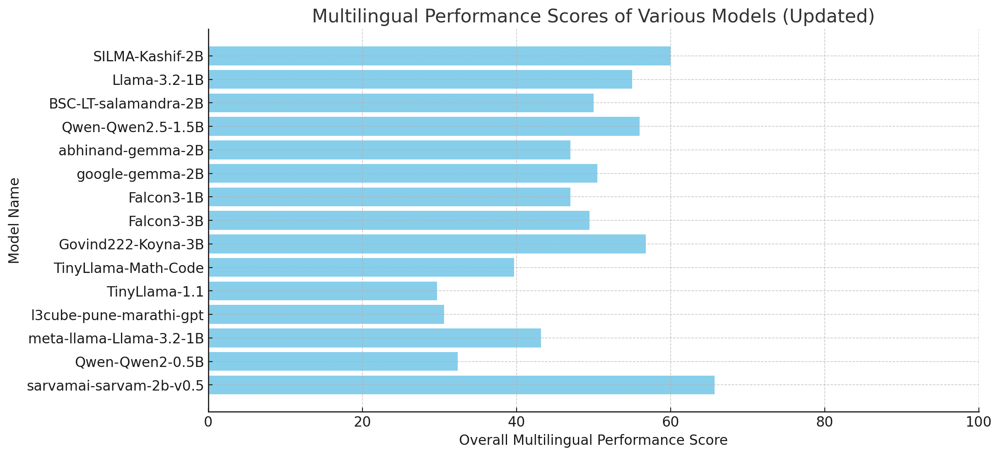

[# Evaluating Indic LLMs: Multilingual Performance Benchmarking

## Overview
This repository is dedicated to evaluating Indic Large Language Models (LLMs) for **multilingual Indian languages** based on predefined questions and their generated outputs. The evaluation includes:
- **Pre-generated model outputs** stored in JSON format.
- **Scoring and analysis** of model responses.
- **Multilingual model evaluation** using `sglang` and `Transformers` libraries.

## Repository Structure

### 1. PreGenerations
- Contains JSON files with model-generated outputs for various prompts.
- These outputs are used for scoring and analysis.

### 2. Pre-Evaluated-LLMs
- Stores **Scores.txt**, which includes:
  - Model-generated response scores.
  - Analysis of responses.
  - Comparisons across different models.

### 3. Multilingual_eval.ipynb
- The main evaluation script.
- Implements:
  - Question generation and submission to models.
  - Evaluation using both `sglang` and `Transformers`.
- Both frameworks are coded separately within the same notebook.

## Installation Guide
For `sglang` installation, refer to the [installation guide](https://github.com/build-ai-applications/Eval-small-model).

## Usage
1. Run the **Multilingual_eval.ipynb** notebook.
2. Review scores in **Pre-Evaluated-LLMs/Scores.txt**.
3. Analyze JSON outputs from **PreGenerations**.

## Contributors
- **[Govind-AIML](https://github.com/Govind-AIML)**
- **[ashutoshqp](https://github.com/ashutoshqp)**

## License
TBD
